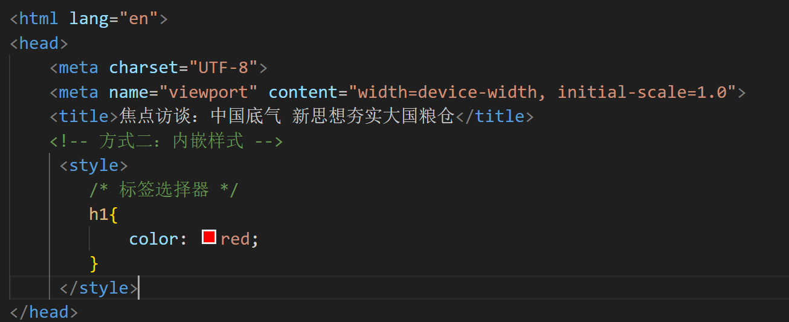
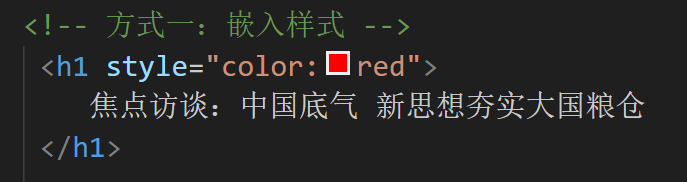
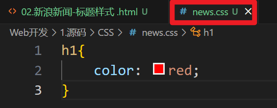
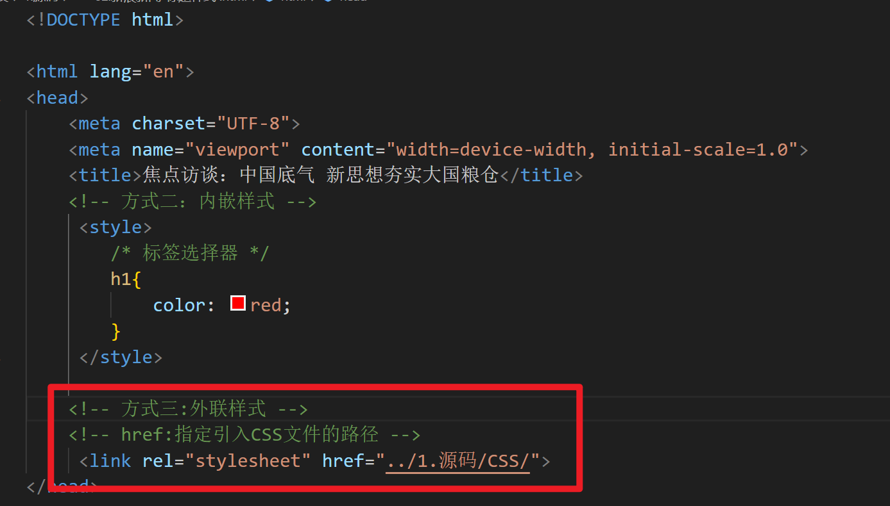
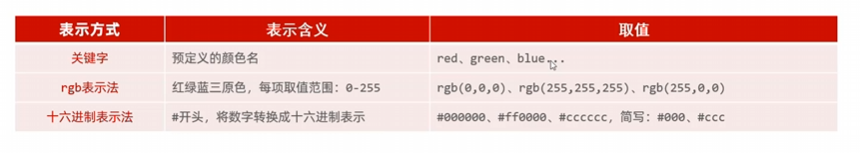
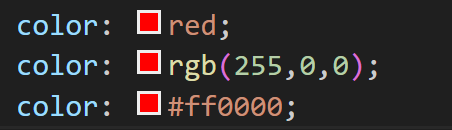

# CSS 引入方式
### 1.行内样式:写在标签的style属性中(不推荐)

### 2.内嵌样式:写在style标签中(可以写在任何位置，但通常约定写在head标签中)

### 3.外联样式:写在一个单独的.css文件中(需要通过link标签在网页中引入)

### 4.颜色的表示形式

### 5.CSS样式官方文档
**https://www.w3school.com.cn/**

